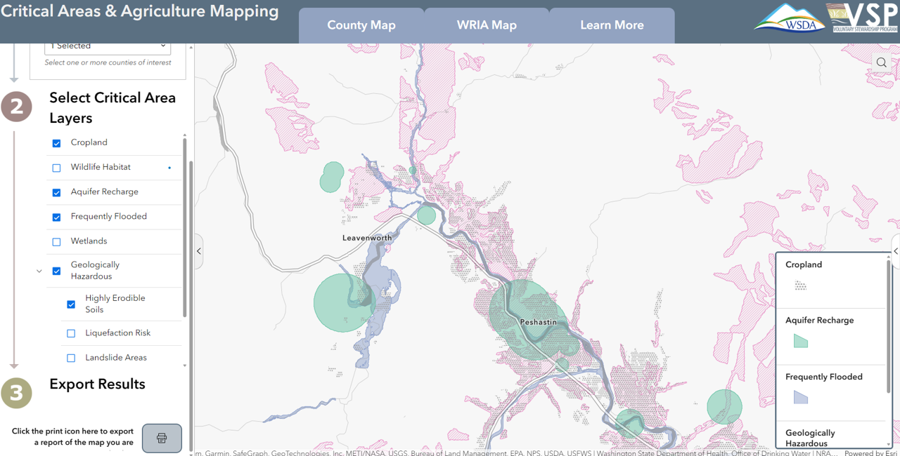

In an effort to support [Voluntary Stewardship Program](https://www.vsp.wa.gov/) (VSP) participants and interested counties, we are in the early stages of development for a tool to bring together the wide array of publicly available datasets related to the [five critical areas](https://www.vsp.wa.gov/critical-areas). Users will be able navigate to counties and watersheds of interest, investigate the intersection of known agricultural land with critical areas, and export report-ready maps for use in VSP work planning and reports. 

[{.img-center fig-alt="Screenshot of mapping tool with cropland, aquifer recharge, frequently flooded, and highly erodible soils layers." target="_blank"}](https://gis.agr.wa.gov/portal/apps/experiencebuilder/experience/?id=649865493c1848de930e374ed9ac07be )
